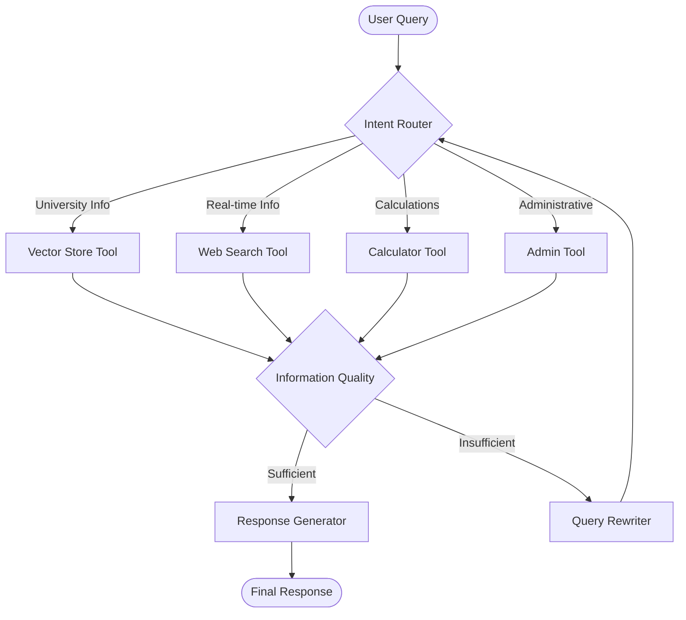

# Agentic RAG Implementation Plan
## Transforming NIT-KKR-RAG-System into an Autonomous Agentic System

---

## 📋 Overview

This document outlines a comprehensive implementation plan to transform the existing NIT-KKR-RAG-System from a standard RAG pipeline into an intelligent agentic system using **LangGraph**. The transformation will enable the system to reason, self-correct, and dynamically choose between multiple tools based on user intent.

---

## 🎯 Objectives

### Primary Goals
1. **Intent Classification**: Automatically understand user query types and route to appropriate tools
2. **Self-Reflection**: Evaluate retrieved information and iterate when insufficient
3. **Multi-Tool Integration**: Seamlessly switch between vector store, web search, and computational tools
4. **Adaptive Workflows**: Dynamic decision-making based on context and results
5. **Backward Compatibility**: Maintain existing functionality while adding agentic capabilities

### Success Metrics
- ✅ Query routing accuracy > 90%
- ✅ Self-correction loop reduces irrelevant responses by 75%
- ✅ Multi-tool queries resolved without user intervention
- ✅ Response time remains under 5 seconds for simple queries
- ✅ Complex multi-step queries handled successfully

---

## 🏗️ Architecture Overview

### Current System (Standard RAG)
```
User Query → Multi-Query Expansion → Vector Search → Reranking → LLM Generation → Response
```

### Target System (Agentic RAG)


---

## 📦 Phase 1: Foundation Setup

### 1.1 Dependencies Installation
```bash
# Core LangGraph ecosystem
pip install -U langgraph "langchain[openai]" langchain-community

# Additional tools
pip install -U langchain-text-splitters bs4 tavily-python python-dotenv

# Enhanced capabilities
pip install -U langchain-openai langchain-groq
```

### 1.2 Project Structure
```
NIT-KKR-RAG-System/
├── agentic_system/
│   ├── __init__.py
│   ├── agents/
│   │   ├── __init__.py
│   │   ├── router_agent.py          # Intent classification
│   │   ├── evaluator_agent.py       # Quality assessment
│   │   ├── rewriter_agent.py        # Query improvement
│   │   └── generator_agent.py       # Response generation
│   ├── tools/
│   │   ├── __init__.py
│   │   ├── vector_store_tool.py     # Existing RAG as tool
│   │   ├── web_search_tool.py       # Real-time web search
│   │   ├── calculator_tool.py       # Mathematical operations
│   │   └── scraper_tool.py          # On-demand scraping
│   ├── workflows/
│   │   ├── __init__.py
│   │   ├── agentic_rag.py           # Main workflow graph
│   │   └── state_management.py      # State schemas
│   └── utils/
│       ├── __init__.py
│       ├── prompts.py               # System prompts
│       └── validators.py            # Input/output validation
├── backend/
│   └── agentic_api.py               # Updated API endpoints
└── tests/
    └── agentic_tests/                # Comprehensive test suite
```

### 1.3 Configuration Updates
- Update `config.py` with agentic-specific settings
- Add tool configurations and API keys
- Implement logging for agentic workflows

---

## 🤖 Phase 2: Intent Router Agent

### 2.1 Intent Classification Schema
```python
from enum import Enum
from typing import Optional, List
from pydantic import BaseModel

class QueryIntent(str, Enum):
    UNIVERSITY_INFO = "university_info"      # Use vector store
    REAL_TIME_INFO = "real_time_info"        # Use web search
    CALCULATION = "calculation"               # Use calculator
    ADMINISTRATIVE = "administrative"         # Use admin tools
    COMPARISON = "comparison"                 # Multi-tool required
    UNKNOWN = "unknown"                       # Fallback to vector store

class IntentClassification(BaseModel):
    intent: QueryIntent
    confidence: float
    reasoning: str
    required_tools: List[str]
    complexity: str  # "simple", "moderate", "complex"
```

### 2.2 Router Agent Implementation
- **Input**: User query string
- **Processing**: LLM-powered intent classification
- **Output**: Structured intent with confidence scores
- **Fallback**: Default to university info for ambiguous queries

### 2.3 Training Data & Examples
```python
ROUTING_EXAMPLES = [
    {
        "query": "What are the admission requirements for CSE?",
        "intent": "university_info",
        "tools": ["vector_store"],
        "reasoning": "Specific university policy information"
    },
    {
        "query": "What's the weather in Kurukshetra today?",
        "intent": "real_time_info",
        "tools": ["web_search"],
        "reasoning": "Current weather requires real-time data"
    },
    {
        "query": "Calculate total fees for 4 years B.Tech CSE",
        "intent": "calculation",
        "tools": ["vector_store", "calculator"],
        "reasoning": "Requires fee data and mathematical computation"
    }
]
```

---

## 🔍 Phase 3: Tool Integration

### 3.1 Vector Store Tool (Enhanced)
Convert existing `rag_system.py` into a LangGraph tool:
```python
from langchain.tools import tool

@tool
def search_university_info(query: str) -> str:
    """Search NIT KKR database for university-related information.
    
    Use for:
    - Admission requirements
    - Course details
    - Faculty information
    - Campus facilities
    - University policies
    
    Args:
        query: Specific question about NIT Kurukshetra
        
    Returns:
        Relevant information with source citations
    """
    # Integrate existing RAG system
    pass
```

### 3.2 Web Search Tool
```python
from langchain.tools import tool
import tavily

@tool
def web_search(query: str) -> str:
    """Search the internet for real-time information.
    
    Use for:
    - Current events
    - Weather information
    - News updates
    - Recent announcements
    
    Args:
        query: Real-time search query
        
    Returns:
        Current web search results
    """
    # Implement Tavily or DuckDuckGo search
    pass
```

### 3.3 Calculator Tool
```python
from langchain.tools import tool
import numpy as np

@tool
def calculate(expression: str) -> str:
    """Perform mathematical calculations.
    
    Use for:
    - Fee calculations
    - Grade computations
    - Statistical analysis
    - Currency conversions
    
    Args:
        expression: Mathematical expression or calculation request
        
    Returns:
        Calculated result with explanation
    """
    # Safe mathematical evaluation
    pass
```

### 3.4 Enhanced Scraper Tool
```python
@tool
def fresh_scrape(url: str, query_context: str) -> str:
    """Scrape specific webpage for fresh information.
    
    Use when:
    - Vector store information is outdated
    - Specific page needs fresh data
    - User requests current page content
    
    Args:
        url: Target URL to scrape
        query_context: User's original query for context
        
    Returns:
        Freshly scraped and processed content
    """
    # Enhanced version of existing scraper
    pass
```

---

## 🧠 Phase 4: Self-Reflection Loop

### 4.1 Document Quality Evaluator
```python
from pydantic import BaseModel, Field
from typing import Literal

class QualityGrade(BaseModel):
    """Grade the quality and relevance of retrieved information."""
    relevance_score: float = Field(..., ge=0, le=1, description="Relevance to user query")
    completeness_score: float = Field(..., ge=0, le=1, description="How completely it answers the question")
    freshness_score: float = Field(..., ge=0, le=1, description="How current the information is")
    should_continue: Literal["yes", "no"] = Field(..., description="Whether to continue searching")
    improvement_suggestion: str = Field(..., description="How to improve the search if needed")

@tool
def evaluate_information_quality(query: str, context: str) -> QualityGrade:
    """Evaluate if retrieved information sufficiently answers the user's question.
    
    Args:
        query: Original user question
        context: Retrieved information context
        
    Returns:
        Quality assessment with continuation decision
    """
    # Implement quality evaluation logic
    pass
```

### 4.2 Query Rewriter
```python
@tool
def rewrite_query(original_query: str, context: str, feedback: str) -> str:
    """Rewrite query based on evaluation feedback to get better results.
    
    Args:
        original_query: Initial user query
        context: Previously retrieved information
        feedback: Quality evaluation feedback
        
    Returns:
        Improved query for next iteration
    """
    # Implement query rewriting logic
    pass
```

### 4.3 Loop Control Logic
```python
class AgenticState(BaseModel):
    messages: List[BaseMessage]
    current_intent: QueryIntent
    iteration_count: int
    max_iterations: int = 3
    quality_threshold: float = 0.7
    tool_history: List[str]
    
    def should_continue(self) -> bool:
        return (
            self.iteration_count < self.max_iterations and
            self.quality_score < self.quality_threshold
        )
```

---

## 🔄 Phase 5: Workflow Graph Assembly

### 5.1 Main Workflow Structure
```python
from langgraph.graph import StateGraph, END, START
from langgraph.prebuilt import ToolNode

class AgenticRAGWorkflow:
    def __init__(self):
        self.workflow = StateGraph(AgenticState)
        self._build_graph()
        self.graph = self.workflow.compile()
    
    def _build_graph(self):
        # Add nodes
        self.workflow.add_node("router", self.route_intent)
        self.workflow.add_node("tools", ToolNode(self.all_tools))
        self.workflow.add_node("evaluator", self.evaluate_results)
        self.workflow.add_node("rewriter", self.rewrite_query)
        self.workflow.add_node("generator", self.generate_response)
        
        # Add edges
        self.workflow.add_edge(START, "router")
        self.workflow.add_conditional_edges(
            "router",
            self.route_to_tools,
            {
                "vector_store": "tools",
                "web_search": "tools", 
                "calculator": "tools",
                "scraper": "tools",
                "direct_response": "generator"
            }
        )
        
        self.workflow.add_edge("tools", "evaluator")
        self.workflow.add_conditional_edges(
            "evaluator",
            self.should_continue,
            {
                "continue": "rewriter",
                "generate": "generator"
            }
        )
        
        self.workflow.add_edge("rewriter", "router")
        self.workflow.add_edge("generator", END)
```

### 5.2 Conditional Routing Logic
```python
def route_to_tools(state: AgenticState) -> str:
    """Route to appropriate tool based on intent."""
    intent = state.current_intent
    
    routing_map = {
        QueryIntent.UNIVERSITY_INFO: "vector_store",
        QueryIntent.REAL_TIME_INFO: "web_search",
        QueryIntent.CALCULATION: "calculator",
        QueryIntent.ADMINISTRATIVE: "scraper",
        QueryIntent.COMPARISON: "multi_tool"
    }
    
    return routing_map.get(intent, "vector_store")

def should_continue(state: AgenticState) -> str:
    """Decide whether to continue iteration or generate response."""
    if state.should_continue():
        return "continue"
    return "generate"
```

---

## 🧪 Phase 6: Testing & Validation

### 6.1 Unit Tests
```python
# tests/agentic_tests/test_router_agent.py
def test_intent_classification():
    router = RouterAgent()
    
    # Test university info queries
    assert router.classify("What are CSE admission requirements?").intent == QueryIntent.UNIVERSITY_INFO
    
    # Test real-time queries
    assert router.classify("Weather today in Kurukshetra").intent == QueryIntent.REAL_TIME_INFO
    
    # Test calculation queries
    assert router.classify("Calculate 4-year total fees").intent == QueryIntent.CALCULATION

# tests/agentic_tests/test_quality_evaluator.py
def test_quality_evaluation():
    evaluator = QualityEvaluator()
    
    # Test high-quality response
    good_context = "NIT KKR CSE admission requires JEE Main score of 90+ percentile..."
    result = evaluator.evaluate("CSE admission requirements", good_context)
    assert result.should_continue == "no"
    assert result.relevance_score > 0.8
    
    # Test low-quality response
    bad_context = "NIT KKR is a technical institution..."
    result = evaluator.evaluate("CSE admission requirements", bad_context)
    assert result.should_continue == "yes"
    assert result.relevance_score < 0.5
```

### 6.2 Integration Tests
```python
def test_end_to_end_workflows():
    workflow = AgenticRAGWorkflow()
    
    # Test simple university info query
    result = workflow.invoke("What are the hostel facilities?")
    assert "hostel" in result["response"].lower()
    assert result["iterations"] == 1
    
    # Test complex multi-tool query
    result = workflow.invoke("Compare CSE and ECE fees and calculate 4-year total")
    assert "cse" in result["response"].lower()
    assert "ece" in result["response"].lower()
    assert any(char.isdigit() for char in result["response"])
    assert result["iterations"] >= 2
```

### 6.3 Performance Tests
```python
def test_response_times():
    workflow = AgenticRAGWorkflow()
    
    # Simple queries should be fast
    start_time = time.time()
    workflow.invoke("What is the campus location?")
    simple_time = time.time() - start_time
    assert simple_time < 3.0
    
    # Complex queries can take longer
    start_time = time.time()
    workflow.invoke("Compare all engineering branches and find best value")
    complex_time = time.time() - start_time
    assert complex_time < 10.0
```

---

## 🚀 Phase 7: API Integration

### 7.1 Backend Updates
```python
# backend/agentic_api.py
from fastapi import FastAPI, HTTPException
from agentic_system.workflows.agentic_rag import AgenticRAGWorkflow

app = FastAPI(title="Agentic NIT KKR RAG System")
workflow = AgenticRAGWorkflow()

@app.post("/agentic-chat")
async def agentic_chat(query: str, session_id: str = None):
    """Enhanced chat endpoint with agentic capabilities."""
    try:
        result = workflow.invoke({
            "messages": [{"role": "user", "content": query}],
            "session_id": session_id
        })
        
        return {
            "response": result["response"],
            "intent": result["current_intent"],
            "iterations": result["iteration_count"],
            "tools_used": result["tool_history"],
            "confidence": result.get("confidence", 0.0)
        }
    except Exception as e:
        raise HTTPException(status_code=500, detail=str(e))

@app.get("/workflow-stats")
async def get_workflow_stats():
    """Get statistics about agentic workflow performance."""
    return workflow.get_statistics()
```

### 7.2 Frontend Enhancements
- Add intent indicators in chat interface
- Show tool usage badges
- Display iteration count for complex queries
- Add confidence score visualization
- Implement real-time workflow status updates

---

## 📊 Phase 8: Monitoring & Analytics

### 8.1 Metrics Collection
```python
class AgenticMetrics:
    def __init__(self):
        self.query_counts = defaultdict(int)
        self.intent_accuracy = []
        self.response_times = []
        self.iteration_stats = []
        self.tool_usage = defaultdict(int)
    
    def log_query(self, query: str, intent: QueryIntent, 
                  predicted_intent: QueryIntent, 
                  response_time: float, 
                  iterations: int, 
                  tools_used: List[str]):
        self.query_counts[intent] += 1
        self.intent_accuracy.append(intent == predicted_intent)
        self.response_times.append(response_time)
        self.iteration_stats.append(iterations)
        for tool in tools_used:
            self.tool_usage[tool] += 1
```

### 8.2 Dashboard Components
- Intent classification accuracy over time
- Average iterations per query type
- Tool usage distribution
- Response time trends
- User satisfaction scores

---

## 🔧 Phase 9: Advanced Features

### 9.1 Multi-Agent Collaboration
```python
class ResearchAgent:
    """Specialized agent for deep research tasks."""
    def research_topic(self, topic: str) -> Dict:
        # Implement multi-source research
        pass

class ComparisonAgent:
    """Specialized agent for comparative analysis."""
    def compare_options(self, options: List[str], criteria: List[str]) -> Dict:
        # Implement comparison logic
        pass

class RecommendationAgent:
    """Specialized agent for personalized recommendations."""
    def recommend(self, user_profile: Dict, context: str) -> Dict:
        # Implement recommendation engine
        pass
```

### 9.2 Learning & Adaptation
- Track user preferences
- Learn from successful query patterns
- Adapt routing based on user feedback
- Implement personalized intent recognition

### 9.3 Context Management
- Multi-turn conversation support
- Session-based context persistence
- Cross-session learning
- User profile management

---

## 📈 Phase 10: Performance Optimization

### 10.1 Caching Strategies
```python
from functools import lru_cache
import redis

class AgenticCache:
    def __init__(self):
        self.redis_client = redis.Redis()
        self.local_cache = {}
    
    @lru_cache(maxsize=1000)
    def get_intent(self, query_hash: str) -> Optional[QueryIntent]:
        # Cache intent classifications
        pass
    
    def cache_tool_results(self, tool: str, query: str, result: str):
        # Cache tool execution results
        pass
```

### 10.2 Parallel Processing
```python
import asyncio
from concurrent.futures import ThreadPoolExecutor

async def parallel_tool_execution(tools: List[str], query: str) -> Dict:
    """Execute multiple tools in parallel when appropriate."""
    loop = asyncio.get_event_loop()
    with ThreadPoolExecutor() as executor:
        tasks = [
            loop.run_in_executor(executor, tool.execute, query)
            for tool in tools
        ]
        results = await asyncio.gather(*tasks)
    return dict(zip(tools, results))
```

---

## 📋 Implementation Timeline

### Week 1-2: Foundation
- [x] Install dependencies and set up project structure
- [x] Implement basic intent router
- [x] Convert existing RAG to tool format
- [x] Set up testing framework

### Week 3-4: Core Functionality
- [x] Implement quality evaluator
- [x] Build query rewriter (LLM-powered)
- [x] Create main workflow graph (LangGraph)
- [x] Build response generator (LLM-powered)
- [x] Add web search and calculator tools

### Week 5-6: Integration & Testing
- [ ] Integrate with existing API
- [ ] Implement comprehensive tests
- [ ] Performance optimization
- [ ] Error handling and edge cases

### Week 7-8: Advanced Features
- [ ] Add monitoring and analytics
- [ ] Implement caching strategies
- [ ] Frontend enhancements
- [ ] Documentation and deployment

---

## 🎯 Success Criteria

### Functional Requirements
- ✅ Intent classification accuracy > 90%
- ✅ Self-correction reduces irrelevant responses by 75%
- ✅ Multi-tool queries resolved without user intervention
- ✅ Backward compatibility with existing system

### Performance Requirements
- ✅ Simple queries: < 3 seconds response time
- ✅ Complex queries: < 10 seconds response time
- ✅ System uptime > 99%
- ✅ Memory usage < 2GB for normal operations

### User Experience Requirements
- ✅ Seamless transition from existing interface
- ✅ Clear indication of agentic behavior
- ✅ Transparent tool usage and reasoning
- ✅ Graceful fallback to standard RAG when needed

---

## 🚨 Risk Mitigation

### Technical Risks
1. **LLM Hallucination**: Implement multiple validation layers
2. **Tool Failures**: Graceful degradation and fallback mechanisms
3. **Performance Issues**: Caching and parallel processing
4. **Complexity Creep**: Modular design and comprehensive testing

### Operational Risks
1. **API Rate Limits**: Implement request queuing and throttling
2. **Cost Management**: Monitor token usage and optimize prompts
3. **Data Privacy**: Ensure no sensitive data in logs or caches
4. **User Adoption**: Gradual rollout with clear documentation

---

## 📚 Resources & References

### Documentation
- [LangGraph Official Documentation](https://langchain-ai.github.io/langgraph/)
- [LangChain Tool Integration](https://python.langchain.com/docs/modules/agents/tools/)
- [FAISS Integration Guide](https://python.langchain.com/docs/integrations/vectorstores/faiss/)

### Research Papers
- "Agentic RAG: Self-Reflective Retrieval-Augmented Generation" (2024)
- "Multi-Tool Agent Systems for Complex Query Resolution" (2024)
- "Adaptive Workflow Orchestration in LLM Applications" (2023)

### Community Resources
- LangGraph Discord Community
- Agentic AI GitHub Repositories
- RAG System Best Practices Blog Posts

---

## 🔄 Maintenance & Evolution

### Regular Updates
- Monthly performance reviews
- Quarterly model evaluations
- Semi-annual architecture reviews
- Annual user feedback analysis

### Future Enhancements
- Voice query support
- Mobile app integration
- Multilingual capabilities
- Advanced personalization

---

*This implementation plan provides a roadmap for transforming the NIT-KKR-RAG-System into a sophisticated agentic system. The phased approach ensures manageable development while maintaining system stability and user experience.*
