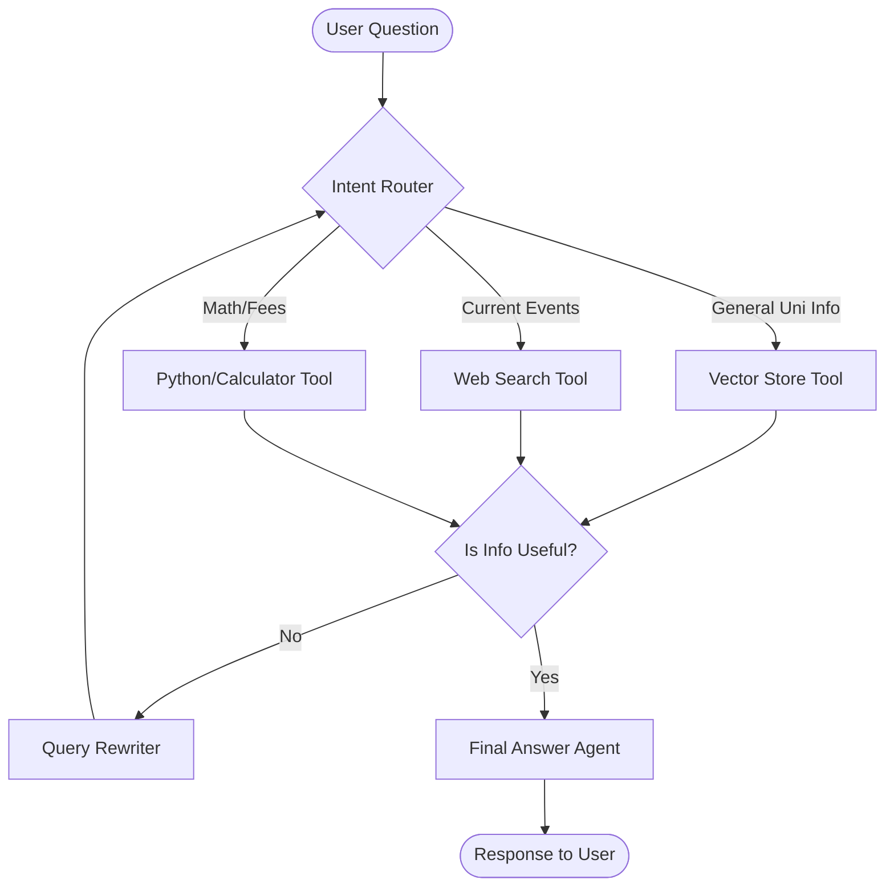

# Agentic RAG: Concepts and Implementation Plan

This document explains what makes a system "agentic" and provides a roadmap to transform the current NIT-KKR-RAG-System into an autonomous agentic system.

---

## 1. What is "Agentic"?

In the context of AI, **"Agentic"** refers to the transition of Large Language Models (LLMs) from being passive "text completers" to **active "agents"** that can:
- **Reason**: Understand complex, multi-step goals.
- **Act**: Use tools (web search, databases, APIs, calculators) to gather information or perform tasks.
- **Observe**: Evaluate the results of their actions.
- **Iterate**: Adjust their strategy if the initial result wasn't sufficient.

### Agentic vs. Non-Agentic
| Feature             | Non-Agentic (Standard RAG)         | Agentic RAG                          |
| :---                | :---                               | :---                                 |
| **Logic**           | Fixed, linear pipeline.            | Dynamic, loop-based logic.           |
| **Tool Use**        | Usually just one (Vector DB).      | Multiple (Search, Python, SQL, etc.).|
| **Self-Correction** | None (Accepts first retrieval).    | High (Asks: "Is this info enough?"). |
| **Planning**        | No explicit planning.              | Breaks complex goals into sub-tasks. |

---

## 2. What is an Agentic Workflow?

An **Agentic Workflow** is a design pattern where the LLM is placed in a loop of **Planning → Execution → Evaluation**. Instead of a single "shot" to get the right answer, the system takes multiple smaller steps.

According to industry leaders (like Andrew Ng), agentic workflows generally follow four patterns:
1. **Reflection**: The LLM looks at its own work and says, "This could be better," then fixes it.
2. **Tool Use**: The LLM decides *when* and *which* tool to use (e.g., "I need to check the current date, I'll use a calendar tool").
3. **Planning**: The LLM creates a step-by-step roadmap to solve a problem.
4. **Multi-Agent Collaboration**: Different agents (e.g., Researcher, Drafter, Reviewer) work together.

---

## 3. Analysis: NIT-KKR-RAG-System Gaps

Currently, your project is a **Standard Advanced RAG** system. While it has great features like *Multi-Query Expansion* and *Reranking*, it lacks agentic behavior in the following ways:

1. **Fixed Pipeline**: It always follows: Expand -> Search -> Rerank -> Generate. It cannot skip steps or add new ones based on the query.
2. **No Tool Diversity**: It can only "look at the documents" you scraped. If a student asks "What is the weather in Kurukshetra today?", it would try to find it in old scraped HTML files rather than using a Weather API.
3. **No Self-Correction**: If the retrieval returns irrelevant data, the system still tries to "hallucinate" an answer or gives a generic "not found" message. An agent would say, "I didn't find it in the documents, let me try a broader search or a different tool."
4. **Limited Reasoning**: It cannot handle multi-part questions like *"Compare the B.Tech CSE fee with ECE and tell me the total for 4 years."* A standard RAG might get fragments; an agent would perform two searches and then a calculation.

---

## 4. How to Convert this Project into an Agentic One

To transform your project, you should adopt an **Agentic Framework** (like LangGraph, CrewAI, or AutoGen) and implement these specific changes:

### Phase 1: The "Router" Agent
Modify `rag_system.py` to include a **Router**. Instead of always searching the Vector Store, the LLM first decides the intent:
- **Intent A**: "University Policy Info" -> Use Vector Store.
- **Intent B**: "Real-time query" -> Use Web Search (e.g., Tavily/DuckDuckGo).
- **Intent C**: "Administrative Task" -> Use a Python REPL tool (for calculations).

### Phase 2: Self-Reflection Loop
Implement a **"Grader"** step:
1. Retrieve documents.
2. An "Evaluation Agent" checks: *"Do these documents actually answer the user's question?"*
3. If NO: Rewrite the query and search again (Iterative Retrieval).
4. If YES: Proceed to generation.

### Phase 3: Multi-Source Integration
Convert your `scraper.py` logic into a **Tool**. An agent could trigger a fresh crawl if the vector store is outdated for a specific topic.

---

## 5. Proposed Code Architecture (Mermaid)

---

## 6. Recommended Tech Stack for the Upgrade
- **Orchestration**: `LangGraph` (best for cyclic agentic loops).
- **Tool Selection**: `LangChain` Custom Tools.
- **Persistence**: Continue using `FAISS` but as a tool within the graph.
- **Real-time**: `Tavily API` for live web search capability.
